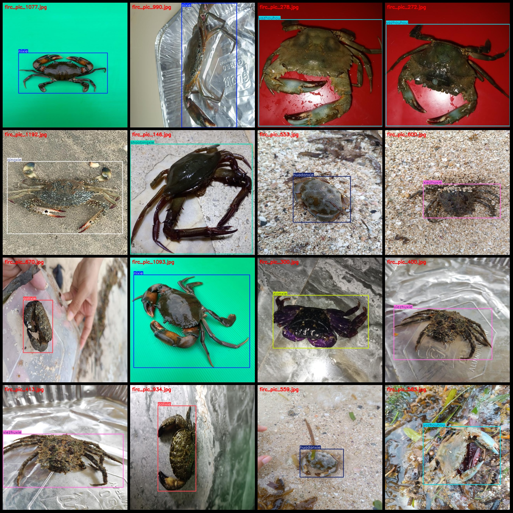
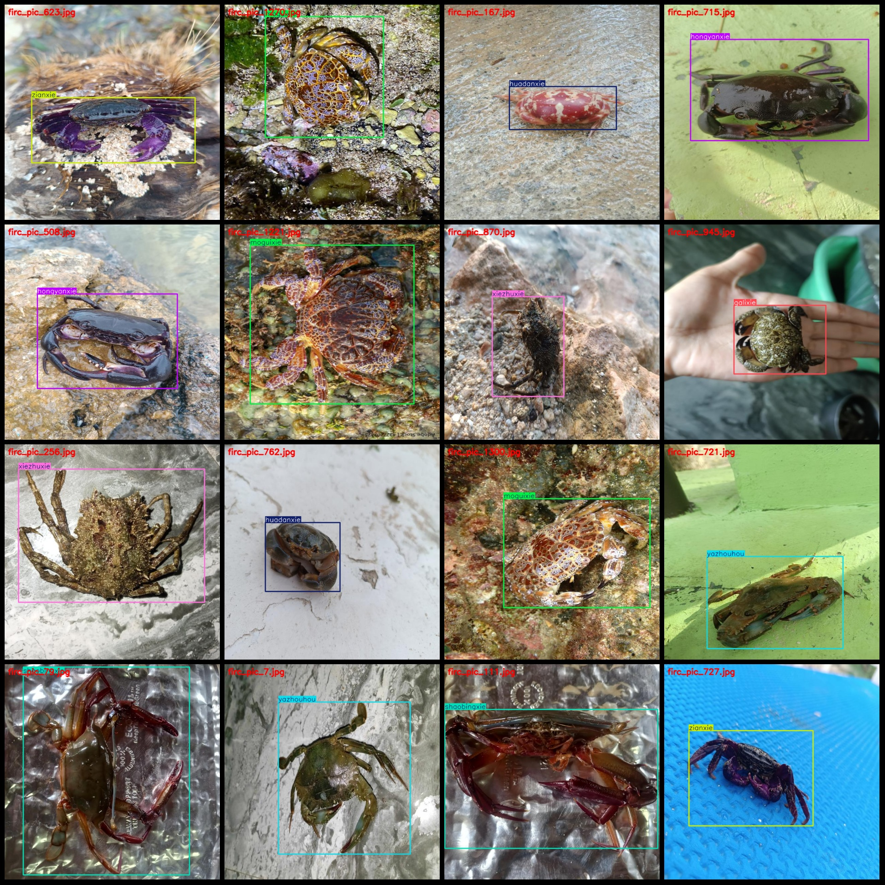

# Crab Species Classification Dataset (VOC+YOLO)

## Dataset Format: Pascal VOC format + YOLO format (txt files without split paths, only containing jpg images and corresponding VOC and YOLO format txt files)

### Image Count (number of jpg files): 1320

### Annotated Count (number of xml files): 1320

### Annotated Count (number of txt files): 1320

### Number of Annotated Categories: 10

### Annotation Category Names (note that the order in the YOLO format does not correspond to this, but is based on the "labels" folder's "classes.txt"): ["galixie", "hongyanxie", "huadanxie", 
"moguixie", "nixie", "qingxie", "shaobingxie", "xiezhuxie", "yazhouhou", "zianxie"]

["Curry Crab", "Red Eye Crab", "Flower Egg Crab", "Devil Crab", "Mud Crab", "Green Crab", "Sentinel Crab", "Scorpion Spider Crab", "Asiatic Mantis Shrimp", "Purple Shore Crab"]

**Number of Boxes for Each Category:**

### Annotation Rules: Draw boxes around the categories.

**Important Note:** The dataset does not have been split into training, validation, or test sets; you will need to manually divide it.

**Special Declaration:** This dataset does not guarantee the accuracy of the models trained on it or the weight files.

**Note:** The dataset does not include any images with labels, as these are typically included in a full VOC dataset. If you need images with labels, please consult the VOC dataset.
Image

Here is a pay link on Stripe ( https://buy.stripe.com/3cs8yP7sY87d0vu9AB ). Please contact me lonlonago@foxmail.com after funding $89, and I will send you a complete data files , thank you!

